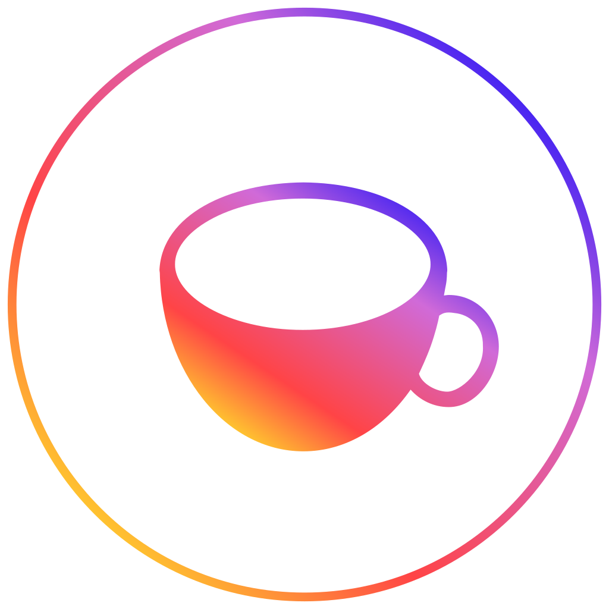
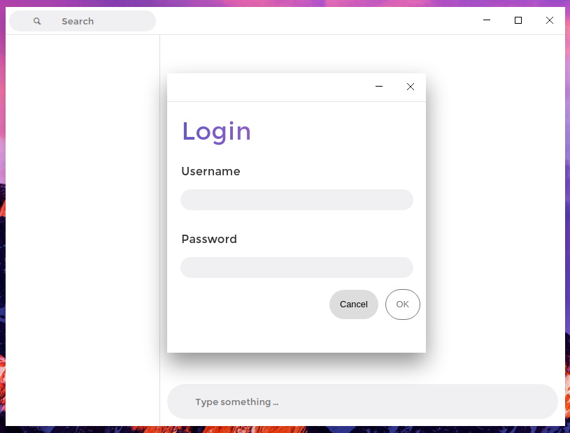
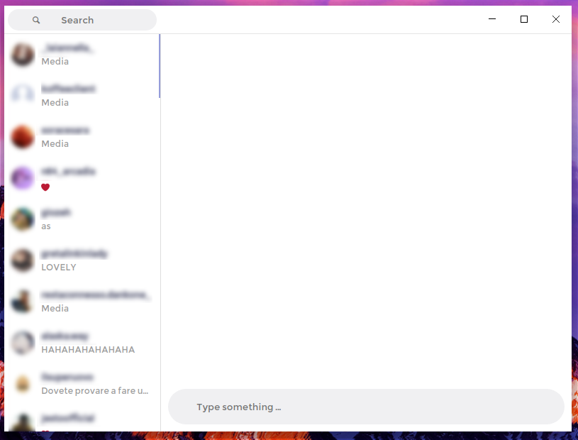
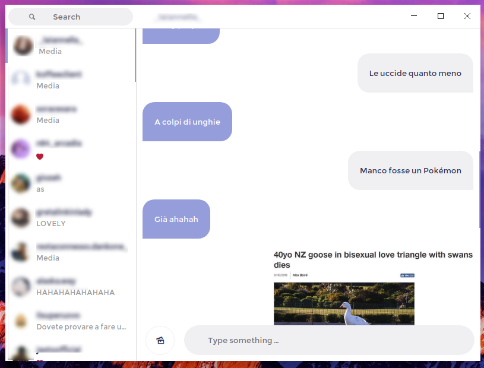
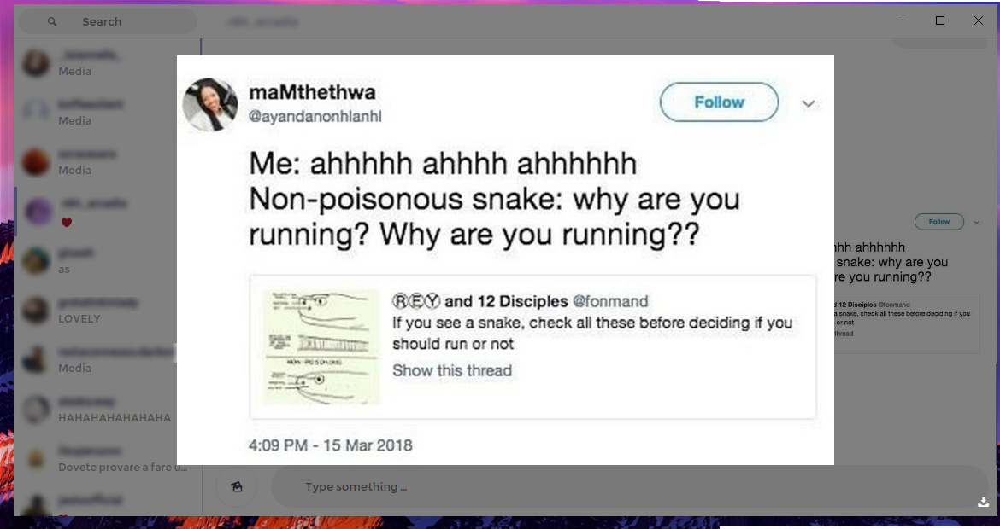
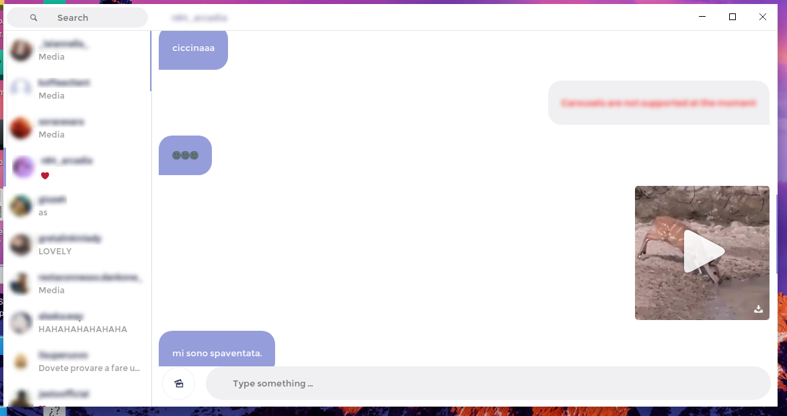

<p align="center"><a target="_blank"></a></p>
<h1 align="center">Koffee</h1>
<h3 align="center">Instagram direct unofficial client</h3>

## Why koffee?
Because i love coffee lol.

## What can i do with koffee?

- Send and receive message in real time (no websocket, so the real time is a bit laggy);
- Send media;
- View every type of shared message;
- Download videos and images straight from koffee;

## Screenshots
#### Login screen
</img>
#### Main screen
</img>
#### Chat screen
</img>
#### Image Zoom
</img>
#### Video message
</img>
## How do i use it?

```
git clone https://github.com/koso00/koffee.git
cd koffee
npm install
npm start
```
if you face problems with electron on ubuntu run
```
sudo npm install -g electron --unsafe-perm=true --allow-root
```

## "I don't want to compile or do strange things, tl;dr"

You can download a release for your platform <a href="https://github.com/koso00/koffee/releases">here</a>


## Incorporated libraries (that i may fork and publish)
- vue-ripple-directive
- emojify.js
- electron-titlebar
- electron-prompt
- photon-kit
